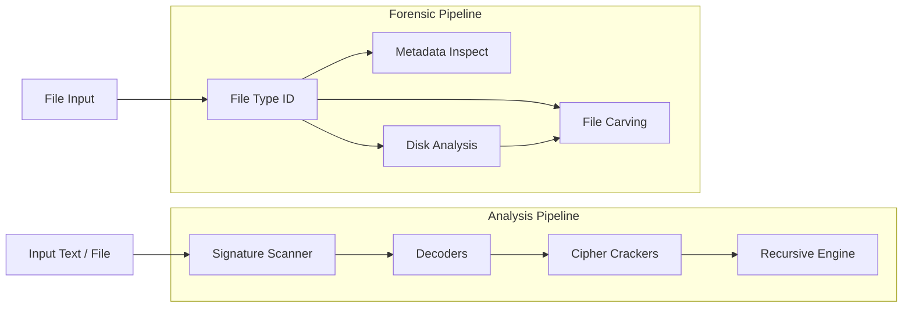

# HashEndra Architecture

```mermaid
graph TB
    CLI[CLI Entry: src/main.rs<br/>+ cli.rs, handlers/]
    LIB[lib.rs<br/>4 modules]

    subgraph core["core/"]
        SCANNER[scanner/<br/>mod + score,<br/>decode, codecs]
        PATTERNS[patterns.rs<br/>Signature scanning,<br/>confidence scoring]
        RECURSIVE[recursive_engine.rs<br/>+ engine_rules.rs<br/>Multi-layer unwrap]
        CRYPTANALYSIS[cryptanalysis.rs<br/>Chi-squared, freq analysis]
        ENCODER[encoder.rs<br/>+ basecodecs.rs<br/>Base64/32/58/85/91,<br/>hex, URL, HTML, morse]
        HASHER[hasher.rs<br/>MD5, SHA1/2/3, BLAKE3]
        ENTROPY[entropy.rs<br/>Rolling entropy,<br/>boundary detection]
    end

    subgraph detectors["detectors/"]
        HASHES[hashes/<br/>85 sigs: digests,<br/>kdf, apps, keys]
        ENCODINGS[encodings.rs<br/>28 encoding sigs]
        CIPHERS[ciphers.rs<br/>Classical cipher sigs]
        CLASSIC[classic_ciphers.rs<br/>+ classic_transposition.rs<br/>Auto-crack ciphers]
        STEGO[stego.rs<br/>File signatures,<br/>magic bytes, carving]
    end

    subgraph forensics["forensics/"]
        CARVE[carve/<br/>profiles, scan,<br/>containers, config]
        DISK[disk/<br/>layout, fingerprint]
        NTFS[ntfs/<br/>parse, recover, report]
        FAT[fat/<br/>parse, recover]
        EXT[ext/<br/>parse]
        INSPECT[inspect/<br/>images, media, audio,<br/>docs, exec, data]
        REPORT[report.rs<br/>Forensic report builder]
        DIRECTORY[directory.rs<br/>Recursive dir scan]
        STRINGS[strings.rs<br/>ASCII / UTF-16<br/>string extraction]
        FILETYPES[filetypes.rs<br/>Magic byte detection]
    end

    CLI --> LIB
    LIB --> core
    LIB --> detectors
    LIB --> forensics
    PATTERNS -.-> HASHES
    PATTERNS -.-> ENCODINGS
    PATTERNS -.-> CIPHERS
    SCANNER -.-> CLASSIC
    INSPECT -.-> STEGO
    CARVE -.-> STEGO
    CARVE -.-> INSPECT
```



## Processing Pipeline



## Detection Flow

```mermaid
sequenceDiagram
    participant U as User
    participant CLI as CLI
    participant P as patterns.rs
    participant S as scanner/
    participant D as detectors/

    U->>CLI: hashendra <input>
    CLI->>P: scan_input(input, context)
    P->>D: match signatures
    D-->>P: detection results
    P->>S: analyze context, entropy, charset
    S-->>CLI: ranked results
    CLI->>U: formatted output
```



## Carving Pipeline

```mermaid
flowchart TB
    DATA[Raw Bytes]
    subgraph Scan["Concurrent Signature Scan (Rayon)"]
        PROFILES[19 CarveProfiles]
        HEADER[Header matching]
    end
    subgraph Slice["Slice Determination"]
        KNOWN[Known end marker]
        LENGTH[Length-hint from header]
        FOOTER[Footer pattern]
        NEXT[Next match boundary]
        MAX[Max size cap]
    end
    subgraph Output["Output Pipeline"]
        DEDUP[BLAKE3 Deduplication]
        WRITE[Write to disk]
        INSPECT_META[Metadata inspection]
        QUOTA[10 GiB hard quota]
    end

    DATA --> PROFILES
    PROFILES --> HEADER
    HEADER --> KNOWN
    KNOWN --> LENGTH
    LENGTH --> FOOTER
    FOOTER --> NEXT
    NEXT --> MAX
    MAX --> DEDUP
    DEDUP --> INSPECT_META
    INSPECT_META --> WRITE
    WRITE --> QUOTA
