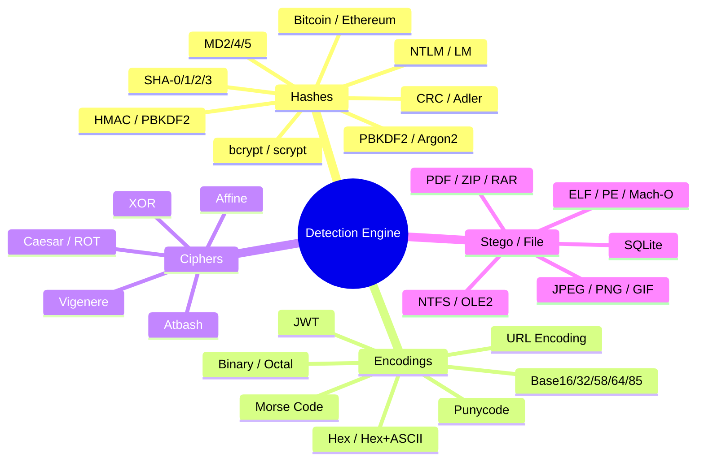
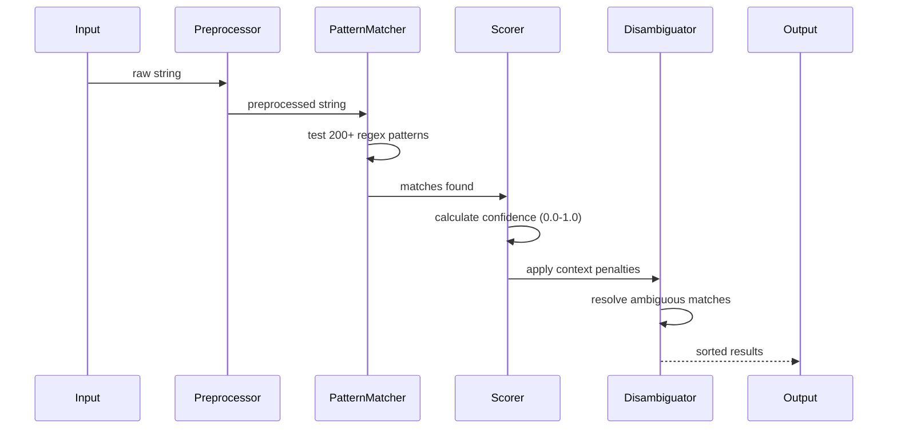

# Detection Signatures

## Overview

HashEndra's detection engine supports **200+ signatures** across four categories:



## How Detection Works



### 1. Pattern Matching

Each signature specifies a regex pattern and a confidence weight:

```json
{
  "name": "MD5",
  "description": "Message-Digest Algorithm 5",
  "pattern": "^[a-fA-F0-9]{32}$",
  "detection_type": "Hash",
  "confidence_weight": 0.9,
  "hashcat_mode": 0,
  "john_format": "raw-md5",
  "security_rating": "Broken",
  "compliance_refs": ["PCI DSS 4.0", "NIST SP 800-131A"]
}
```

### 2. Scoring

Raw confidence = match * `confidence_weight`. Then `score_detection()` adjusts based on:

- **Entropy analysis** — Does the entropy match expected values?
- **Charset validation** — Is the charset consistent?
- **Semantic validation** — Can Base64 decode? Is the JSON valid inside JWT?
- **Repeated character penalty** — Sequences of "A", "0", etc. reduce score
- **Context weighting** — Some signatures score higher in specific contexts

### 3. Ambiguity Penalties

- **Hash ambiguity** — 32-char hex could be MD5, NTLM, or MD4. All get multiplied by `0.80` (generic context)
- **Encoding ambiguity** — Base64 vs Base64 URL vs JWT vs Base85 all get `0.90` multiplier when co-detected
- **Hex encoding** — Capped at 35% confidence to avoid false positives

### 4. Security Ratings

| Rating | Meaning | Examples |
|---|---|---|
| `Secure` | Modern, strong algorithms | Argon2, SHA-3, bcrypt (cost≥10) |
| `Weak` | Not broken but fast/old | SHA-1, PBKDF2 (low cost) |
| `Broken` | Known collision attacks | MD5, SHA-0 |
| `Insecure` | Trivial to crack | DES, 40-bit RC4 |

## Hash Signatures

Covers **130+ hash types** including:

| Category | Examples |
|---|---|
| MDC Family | MD2, MD4, MD5 |
| SHA Family | SHA-0, SHA-1, SHA-224/256/384/512 |
| SHA-3 Family | SHA3-224/256/384/512, SHAKE128/256 |
| BLAKE Family | BLAKE2b/2s, BLAKE3 |
| Windows | NTLM, LM, NT, MSCACHE |
| Linux/Unix | SHA-512crypt, SHA-256crypt, bcrypt, MD5crypt |
| Modern KDFs | Argon2(i/d/id), PBKDF2-HMAC-SHA*, scrypt |
| CRC | CRC-8/16/32/64, CRC-16-IBM, CRC-32C |
| Adler | Adler-32 |
| Blockchain | Bitcoin (hash160, SHA-256d), Ethereum |
| HMAC | HMAC-SHA1/256/512 |
| RIPEMD | RIPEMD-160/256/320 |
| Whirlpool | Whirlpool |
| GOST | GOST R 34.11-94, Streebog |
| Grøstl | Grøstl-224/256/384/512 |

## Encoding Signatures

| Encoding | Detection Pattern | Confidence |
|---|---|---|
| Base64 | `^[A-Za-z0-9+/]*={0,2}$` | High (valid validation) |
| Base64 URL | `^[A-Za-z0-9_-]*$` | High (after decode check) |
| Base32 | `^[A-Z2-7]+=*$` | Medium |
| Base58 | `^[1-9A-HJ-NP-Za-km-z]+$` | Medium |
| Hex | `^[a-fA-F0-9]+$` | Medium (capped at 35%) |
| URL Encoding | contains `%` or `+` | Medium |
| JWT | 3-part dot-separated | High (JSON validation) |
| Binary | `^[01 ]+$` | Medium |
| ASCII85 | starts with `~<` | High |

## Cipher Signatures

| Cipher | Detection | Auto-Crack |
|---|---|---|
| Caesar / ROT | Frequency analysis | Yes (Chi-squared scoring) |
| Vigenere | Kasiski examination + IoC | Yes (key length detection) |
| Affine | Letter frequency | Yes (brute-force a,b pairs) |
| Atbash | Reversed alphabet mapping | Yes (immediate) |
| Single-byte XOR | Frequency analysis | Yes (top 3 key candidates) |

## Stego / File Signatures

HashEndra detects files by their **magic bytes** (file signatures):

| Extension | Magic Bytes | Description |
|---|---|---|
| `jpg` | `FF D8 FF` | JPEG image |
| `png` | `89 50 4E 47` | PNG image |
| `gif` | `47 49 46 38` | GIF image |
| `bmp` | `42 4D` | BMP image |
| `tiff` | `49 49 2A 00` / `4D 4D 00 2A` | TIFF image |
| `ico` | `00 00 01 00` | ICO icon |
| `pdf` | `25 50 44 46` | PDF document |
| `doc` | `D0 CF 11 E0` | OLE2 document (DOC/XLS/PPT) |
| `zip` | `50 4B 03 04` / `50 4B 05 06` | ZIP archive |
| `rar` | `52 61 72 21` | RAR archive |
| `7z` | `37 7A BC AF 27 1C` | 7-Zip archive |
| `gz` | `1F 8B` | GZIP archive |
| `elf` | `7F 45 4C 46` | ELF binary |
| `pe` | `4D 5A` | PE (Windows executable) |
| `macho` | `FE ED FA CE` / `FE ED FA CF` | Mach-O binary |
| `sqlite` | `53 51 4C 69 74 65` | SQLite database |
| `wav` | `52 49 46 46 .... 57 41 56 45` | WAV audio |
| `avi` | `52 49 46 46 .... 41 56 49 20` | AVI video |
| `mp4` | `.... 66 74 79 70` | MP4 video (ftyp at offset 4) |
| `mp3` | `49 44 33` | MP3 with ID3v2 header |
| `flac` | `66 4C 61 43` | FLAC audio |
| `mft` | `46 49 4C 45` | NTFS MFT record |
| `lnk` | `4C 00 00 00 01 14 02 00` | Windows shortcut |

## Custom Signatures

Users can add custom detection signatures via a JSON file at `~/.hashendra/signatures.json`.

Example `~/.hashendra/signatures.json`:

```json
[
  {
    "name": "My Custom Hash",
    "description": "A custom hash format used by my app",
    "pattern": "^[a-f0-9]{64}$",
    "detection_type": "Hash",
    "confidence_weight": 0.9,
    "common_name": "myhash",
    "hashcat_mode": null,
    "john_format": null,
    "security_rating": "Weak",
    "compliance_refs": [],
    "parameters": []
  },
  {
    "name": "Internal Auth Token",
    "description": "Corp internal JWT-like token",
    "pattern": "^auth_[A-Za-z0-9+/]{40,100}$",
    "detection_type": "Encoding",
    "confidence_weight": 0.8,
    "common_name": "auth_token",
    "hashcat_mode": null,
    "john_format": null,
    "security_rating": "Weak",
    "compliance_refs": [],
    "parameters": ["token"]
  }
]
```

### Signature Fields

| Field | Type | Description |
|---|---|---|
| `name` | string | Display name |
| `description` | string | Brief description |
| `pattern` | string | Regex pattern (must compile) |
| `detection_type` | "Hash" / "Encoding" / "Cipher" / "Stego" | Detection category |
| `confidence_weight` | float 0.0–1.0 | Base confidence multiplier |
| `common_name` | string (optional) | CLI shorthand name |
| `hashcat_mode` | int (optional) | Hashcat mode number |
| `john_format` | string (optional) | John the Ripper format |
| `security_rating` | "Secure" / "Weak" / "Broken" / "Insecure" (optional) | Security level |
| `compliance_refs` | string[] | Compliance standard references |
| `parameters` | string[] | Named capture groups in pattern |

### Loading Custom Signatures

Custom signatures are loaded automatically from `~/.hashendra/signatures.json`. The signatures merge with built-in ones — you can even override built-in detection by using the same name.

To verify your custom signatures are loaded:

```bash
hashendra --list-hashes  # Check if your custom hash appears
```
