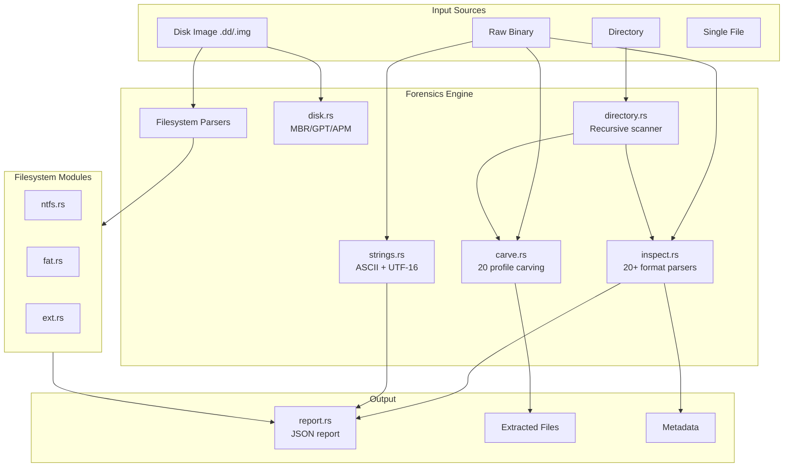
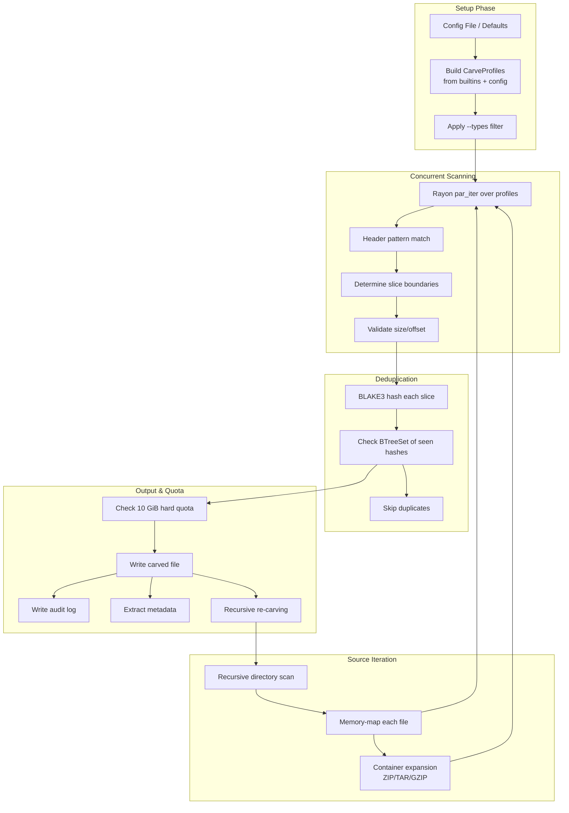

# Forensics Module

## Overview

The forensics module provides disk analysis, file carving, metadata inspection, and string extraction capabilities:



## Disk Analysis

### Supported Partition Schemes

| Scheme | Detection | Description |
|---|---|---|
| MBR | `55 AA` at offset 510 | Legacy Master Boot Record |
| GPT | `EFI PART` at offset 512 | GUID Partition Table |
| APM | Apple partition map | Apple Partition Map |

### Supported Filesystems

| FS | Features |
|---|---|
| NTFS | $MFT parsing, resident/non-resident attributes, data runs, deleted entry recovery, $Bitmap, $LogFile |
| FAT12/16/32 | BPB parsing, FAT chain walking, directory entries (VFAT long names), deleted entry recovery |
| ext2/3/4 | Superblock, block groups, inode tables, extent trees, deleted inode recovery |
| Btrfs | Superblock parsing, chunk/dev/extent tree scanning |

### Disk CLI

```bash
# Basic disk inspection
hashendra forensic disk disk_image.dd

# NTFS with deleted file recovery
hashendra forensic disk --fs ntfs --deleted-only disk.dd

# Extract deleted files
hashendra forensic disk --extract-data recovered/ --deleted-only --fs ntfs disk.dd

# ext4 with explicit offset
hashendra forensic disk --offset 1048576 --fs ext4 disk.dd

# FAT with directory entries
hashendra forensic disk --fs fat --include-directories disk.dd
```

### NTFS Recovery

NTFS recovery supports:

- **Resident data** — Small files stored directly in the MFT record
- **Non-resident data** — Files spanning multiple clusters, recovered via data run parsing
- **Deleted entries** — MFT records marked as inactive but data still present
- **Alternate data streams** — ADS content recovery
- **Directory reconstruction** — File names and paths from $INDEX_ROOT/$INDEX_ALLOCATION

## File Carving

Carving extracts embedded files from raw binary data (disk images, memory dumps, network captures).

### Architecture



### Slice Boundary Strategies

| Strategy | Description | Used For |
|---|---|---|
| Known End Marker | Match a specific footer byte sequence | PNG (IEND), JPEG (EOI), ZIP (EOCD) |
| Length from Header | Extract embedded size from header fields | BMP, AVI, WAV, TIFF |
| Footer Pattern | Match a regex-based end pattern | Config-defined profiles |
| Next Match | End at the next header of same type | Streaming formats |
| Max Size | Use configured maximum size | Formats without boundaries |

### Carve Profiles

Profiles define what to carve and how:

| Field | Type | Description |
|---|---|---|
| `extension` | string | File extension |
| `description` | string | Human-readable name |
| `headers` | BytePattern[] | One or more start signatures (OR'd) |
| `footer` | BytePattern (optional) | Known end signature |
| `max_size` | int (optional) | Maximum size cap |
| `min_offset` | int | Minimum offset to consider |

### Custom Carve Profiles

Create a custom config file and load it with `--config`:

**Format:** One profile per line:
```
<extension> <needs_footer(y/n)> <max_size> <header_hex> [footer_hex] <description>
```

Example `custom.conf`:
```conf
# Custom carve profiles
mybin y 4096 DEADBEEF CAFEBABE My Binary Format
archive y 0 504B0304 504B0506 ZIP Archive
rawdata n 1024 AABBCC - Raw Data Chunk
```

Usage:
```bash
hashendra forensic carve -c custom.conf disk.dd -o carved/
hashendra forensic carve -c custom.conf --list-types
```

### Safety

- **10 GiB hard quota**: Cannot be bypassed via command-line flags
- **Deduplication**: BLAKE3 hashing prevents redundant extraction
- **Min/max size limits**: Prevent runaway carving from corrupted data

## Metadata Inspection

HashEndra inspects 20+ file formats for metadata:

```bash
hashendra forensic scan image.jpg
```

### JPEG/EXIF
- JFIF header version, density units, thumbnail
- EXIF IFD0: Make, Model, Software, DateTime
- EXIF SubIFD: ISO, Aperture, Shutter Speed, Focal Length, Flash
- GPS SubIFD: Latitude, Longitude, Altitude
- XMP data recovery (raw traversal)
- Marker segment analysis
- kamadak-exif integration for rich field extraction

### PNG
- IHDR: width, height, bit depth, color type, compression, filter, interlace
- gAMA: gamma value
- pHYs: pixels per unit, unit specifier
- tEXt/zTXt/iTXt: key-value metadata, compressed XML
- tIME: last-modified timestamp
- oFFs: image offset

### MP3/ID3
- ID3v2: title, artist, album, year, track, genre, comment, composer
- ID3v1 fallback for legacy tags
- MPEG sync detection: bitrate, sample rate, layer, channel mode
- Frame count estimation

### FLAC
- STREAMINFO: sample rate, channels, bits per sample, total samples, duration
- VORBIS_COMMENT: artist, album, title, date, etc.

### WAV
- fmt chunk: audio format, channels, sample rate, byte rate, block align, bits per sample
- Duration calculation

### OOXML (DOCX/XLSX/PPTX)
- ZIP-based XML parsing via quick-xml
- Core properties: title, subject, creator, keywords, description
- Revision history: last modified by, created/modified dates
- Application-specific: word count, paragraph count, slide count

### ELF
- Class (32/64-bit), endianness, OS/ABI
- ELF type (EXEC, DYN, REL, CORE), machine architecture
- Entry point address, program header count, section header count
- Section names (via string table)

### PE
- 32/64-bit magic, machine type (x86, x64, ARM, etc.)
- Number of sections, timestamp, entry point
- Image base, subsystem (GUI, console, driver)

### Mach-O
- 32/64-bit magic, CPU type/subtype
- File type (EXECUTE, DYLIB, BUNDLE, etc.)
- Number of load commands

### SQLite
- Page size, write/read version
- Schema format number
- Text encoding (UTF-8, UTF-16le, UTF-16be)

## String Extraction

Extract printable strings from binary data:

```bash
# In forensic scan mode, strings are extracted automatically
hashendra forensic scan malware.bin

# Minimum string length (default: 4)
# UTF-16LE strings are detected alongside ASCII
```

Features:
- ASCII string extraction (configurable minimum length)
- UTF-16LE string extraction (including partial support)
- Offset tracking for each string
- Flattened output with encoding markers

## Report Generation

All forensic operations produce structured reports in JSON format:

```bash
hashendra forensic scan --json image.jpg
hashendra forensic carve --dry-run disk.dd
```

Report fields include:
- File metadata and type detection
- Carving statistics (matches, written, bytes, deduplication)
- String extraction results with offsets
- Metadata inspection results
- Disk analysis with partition and filesystem details
- Source tracking for multi-file operations
